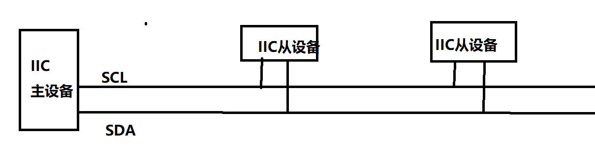
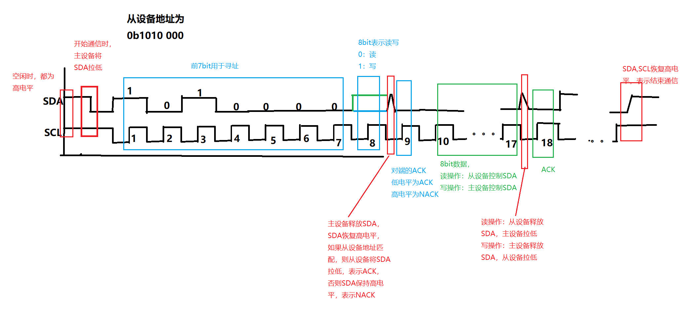

# 协议介绍

* 主设备和从设备,主设备发起会话。
* SCL 时钟线，由主设备控制，用于同步通信
* SDA 数据线，由所有设备共用

报文
* 三种信号：START(开始会话),STOP(结束会话), ACK(通知对方，继续发送)
* 两种数据：从设备地址(7bit)，数据(8bit)


时序图


## S3C2440控制器

### 通过中断驱动IIC通信
以下情况可以触发中断
1)当仲裁失败——本次传输没有抢到总线，可以稍后继续
2)对于主机模式，当发出S信号，地址信息，并经过一个SCL周期后，发送中断——主机可以在此时判断释放成功寻址从机
3)对于从机模式，当接受地址与IICADD寄存器吻合时，先发出ACK信号，然后发生中断——从机可以在此时准备后续的传输
4)对于发送器，当发送完一字节数据并经过一个SCL周期（对于ACK信号）后，发送中断。这时可以准备下一个要发送的数据，或发出P信号以终止传输
5)对于接收器，当收到一个数据时，先根据IICCON[7]决定释放发出ACK信号后，然后发生中断，这时可以读取IICDS寄存器得到数据，并设置IICCON[7]以决定接受到下一个数据后释放发出ACK信号。


## S3C2440示例代码
### 初始化
```c
void i2c_init()
{
	// 1) GPIO设置
	GPEUP |= 0xc000;     // 禁止内部上拉, (1 << 15) | (1 << 14);
	GPECON |= 0xa000000; // 选择引脚功能，GPE15:IICSDA, GPE14:IICSCL

	INTMASK &= (BIT_IIC);

	// 2) 波特率设置
	// 3) 使能ACK，中断
	/*
	 * bit[7] = 1 使能ACK
	 * bit[6] = 0 设置时钟源，IICCLK = PCLK/16
	 * bit[5] = 1 使能中断
	 * bit[3:0] = 0xf, 设置分频系数，得到波特率，Tx clock = IICCLK/16
	 * PCLK = 50MHz, IICCLK = 3.125MHz, Tx Clock = 0.195MHz
	 */

	IICCON = (1 << 7) | (0 << 6) | (1 << 5) | (0xf); // 0xaf

	IICADD = 0x10;  // s3c24xx slave address = [7:1]

	IICSTAT = 0x10; // IIC串行输出使能(Rx/Tx)
}
```
禁止内部上拉：
内部上拉指，将引脚连接到上拉电阻，确保其始终为0/1，避免电磁干扰。
如果禁止内部上拉，则GPIO的电平默认状态是不确定的，需要外部驱动。


使能ACK：
在Tx模式，IICSDA不控制，在ACK时段。
在Rx模式，IICSDA被占用，在ACK时段。

### 写操作

```c
void i2c_write(unsigned int slvaddr, unsigned char *buf, int len)
{
	g_ts3c24xx_iic.mode = WRDATA;    // 写操作
	g_ts3c24xx_iic.pt = 0;           // 索引值为0
	g_ts3c24xx_iic.pdata = buf;      // 保存缓冲区地址
	g_ts3c24xx_iic.datacount = len;  // 传输长度

	// 1) 首先发送从设备地址
	IICDS = slvaddr;

	// 2) 启动发送
	/*
	 * [7:6]: 11 ，master transmit mode *
	 * [5]: 1，读:busy, 写:Start信号产生，IICDS在start信号后自动发送 *
	 * [4]: 1, 使能Rx/Tx *
	 * [3]: 0, 总裁状态位（应该是用于读的）,0:总线总裁成功，1:总裁失败
	 * [2]: 0 作为从设备的状态位，不关心
	 * [1]: 0 不关心
	 * [0]: 0 只读，0:表示最后接受的是0(ack),1：最后没有收到ACK
	 */
	IICSTAT = 0xf0;    // 主机发送，启动，发送START信号，和从设备地址
	
	// 3) 等待发送完成
	while (g_ts3c24xx_iic.datacount != 01);
}
```
IICDS(Data shift):
8-bit data shift register for IIC-bus Tx/Rx operation.
When serial output enable = 1 in the IICSTAT, IICDS is write-enabled. The IICDS value can be read any time, regardless of the current serial output enable bit (IICSTAT) setting


### 读操作
```c
void i2c_read(unsigned int slvaddr, unsigned char *buf, int len)
{
	g_ts3c24xx_iic.mode = RDDATA;
	g_ts3c24xx_iic.pt = -1;
	g_ts3c24xx_iic.pdata = buf;
	g_ts3c24xx_iic.datacount = len;

	// 首先发送从设备地址
	IICDS = slvaddr;
	
	/*
	 * [7:6]:10 master recive mode
	 * [5]: 1   read)Busy，当前还没有数据，所以不能读
	 * [4]: 1   Enable Rx/Tx
	 * [3:0]:   只读，不关心
	 */
	IICSTAT = 0xb0; // 主机接受，启动, 发送START信号，和从设备地址

	// 3) 等待接收到指定长度的数据
	while (g_ts3c24xx_iic.datacount != 01);
}
```

### 中断服务
* 产生中断：
0)从设备地址发送完成后，产生中断
1)读操作：收到一字节数据后，产生中断
2)写操作 ,发送完一个字节数据后，产生中断

* 中断导致IIC暂停通信
当中断产生，IICCON[4]会被设置为1，表示IIC由于中断被挂起，此时SCL信号被一直拉低，让IIC通信停止，用户需要处理IIC中断，处理完后将IICCON[4]清零，恢复IIC通信.
```c
void i2c_int_handle(void)
{
	unsigned int iicst, i;

	// 清中断
	SPCPND = BIT_IIC;
	INTPND = BIT_IIC;

	iicst = IICSTAT;

	if (iicst & 0x8)
		printf("Bus arbitration failed\n"); // 仲裁失败
	
	switch (g_ts3c24xx_iic.mode) {
		case WRDATA:
			if ((g_ts3c24xx_iic.datacount--) == 0) { // 所有数据发送完成
				// 恢复IIC操作，发送P信号
				/*
				 * [7:6]:11 使用 master transmit mode
				 * [5]: 0 write)发送P信号
				 * [4]: 1 enable Rx/Tx
				 * 其他为只读状态
				 */
				IICSTAT = 0xd0;
				IICCON = 0xaf; // 恢复IIC通信,此时P信号发出
				Delay(1000); // 等待一段时间，以便P信号已经发出
				break;
			}

			// 发送数据，将下一个字节的数据写到IICDS
			IICDS = g_ts3c24xx_iic.pdata[g_ts3c24xx_iic.pt++];

			for (i = 0; i < 10; i++); // 等待 IICDS的数据都移位发送完成

			IICCON = 0xaf; // 恢复IIC通信，此时，IICDS数据发送
		break;

		case RDDATA:
			if (g_ts3c24xx_iic.pt == -1) {
				// 这次的中断是发送IIC设备地址后发生的，没有数据可接受
				g_ts3c24xx_iic.pt = 0; // 设置标志，下次会有数据可接受

				// 只接受一个字节数据时，不发送ACK信号,直接发送STOP
				if (g_ts3c24xx_iic.datacount == 1) 
					IICCON = 0x2f; // 不发送ACK，恢复IIC
				else
					IICCON = 0xaf; // 会发送ACK，恢复IIC

				break;
			}

			// 收到一个字节数据
			
			if ((g_ts3c24xx_iic.datacount--) == 0) {
				g_ts3c24xx_iic[g_ts3c24xx_iic.pt++] = IICDS;
				// 恢复IIC，发送P信号
				IICSTAT = 0x90;
				IICCON = 0xaf; // 开启ACK,以后会话会发送ACK
				Delay(1000); // 等待一段时间以便P信号已经发出
				break;
			}

			g_ts3c24xx_iic.pdata[g_ts3c24xx_iic.pt++] = IICDS;

			// 还有最后一个数据待接受，接受最后一个字节时，不发送ACK信号 
			if (g_ts3c24xx_iic.datacount == 0)
				IICCON = 0x2f;
			else
				IICCON = 0xaf;

		break;
	}
}
```

### 与RTC芯片M41t11的操作示例
```c
int m41t11_set_datetime(struct rtc_time *dt)
{
	unsigned char leap_yr;
	struct {
		unsigned char addr;
		struct rtc_registers rtc;
	} addr_and_regs;
	... // 设置rtc结构
	i2c_write(0xD0, (unsigned char *)&addr_and_regs, sizeof(addr_and_regs));
}
```

```c
int m41t11_set_gettime(struct rtc_time *dt)
{
	unsigned char addr[1] = {0};	
	struct rtc_registers rtc = {0};
	i2c_write(0xD0, addr, 1); // 设置要操作的M41t11的寄存器地址为0, 设置要读的数据的地址
	i2c_read(0xD0, (unsigned char *)&rtc, sizeof(rtc)); // 读取m41t11各个寄存器的值
	.. // 根据读出的寄存器结构，设置dt结构
	return 0;
}
```
