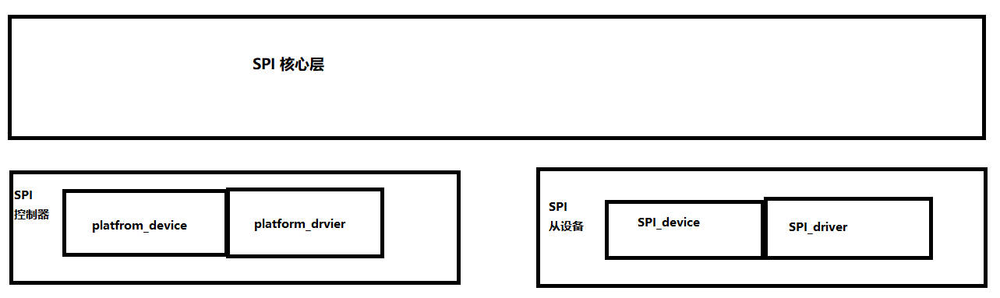

# 从裸机到驱动框架分析
SPI裸机程序可以分为三个模块
* SPI接口模块：负责根据SPI时序接受发送数据
* 从设备模块：负责数据的含义
* 板级模块：负责线路


驱动使用分层和分离的思想
SPI驱动：
* spi核心层
* spi\_master(也称为 spi\_controller) : 对应SPI控制器，负责收发
* spi\_driver : 处理从设备模块逻辑
* spi\_device : 硬件资源，包括片选，支持的波特率，支持的SPI mode

# SPI驱动模块详解
## spi\_device 的创建
使用spi\_register\_board\_info

```c
machine_desc->init_machine
   spi_register_board_info  // board info 包含spi从设备信息
   list_for_each_entry(master, &spi_master_list, list) // spi_master_list 为spi 控制器链表
      spi_match_master_to_boardinfo(master, &bi->board_info); // 将spi从设备添加到对应的spi 控制器上
         if (master->bus_num != bi->bus_num) // 根据bus_num确定是哪个控制器
             return;
         dev = spi_new_device(master, bi);    // 分配spi_device，并根据spi board_info 初始化它，
            proxy = spi_alloc_device(master); 
            spi_add_device(proxy);
	       device_add(&spi->dev);    // 添加到bus->p->klist_devices，如果已经有driver的话会调用probe函数
```
## spi\_driver 和 spi\_device 的probe
调用 bus\-\>match 测试 device和driver是否匹配，
然后优先调用 bus\-\>probe ，否则调用 drv\-\>probe
```c
device_add(&spi->dev);
   bus_add_device(struct device *dev)
      klist_add_tail(&dev->p->knode_bus, &bus->p->klist_devices);
   bus_probe_device(dev);
      device_attach(dev);
         bus_for_each_drv(dev->bus, NULL, dev, __device_attach); // 遍历bus->p->klist_driver，调用__device_attach
	    __device_attach
               if (!driver_match_device(drv, dev)) return 0;
                  // drv->bus->match ? drv->bus->match(dev, drv) : 1;
               driver_probe_device(drv, dev);
                  really_probe(dev, drv);
		     dev->driver = drv;
                     if (dev->bus->probe)
                         dev->bus->probe(dev);
                     else if (drv->probe)
                         drv->probe(dev);
               
```

## spi bus 的 match 函数
spi 的 bus 为 spi\_bus\_type
```c
struct bus_type spi_bus_type = {
   .name       = "spi",
   .dev_attrs  = spi_dev_attrs,
   .match      = spi_match_device,
   .uevent     = spi_uevent,
   .pm     = &spi_pm,
};
```

匹配优先级 : dtb >  id\_table > name
```c
spi_match_device
   of_driver_match_device(dev, drv)
   spi_match_id(sdrv->id_table, spi)
   strcmp(spi->modalias, drv->name)
```

## 数据收发
spi\_driver 发数据
一个spi\_message 代表一次单项传输
一个或多个spi\_transfer 组成一个 spi\_message
```c
spi_write
   struct spi_transfer t = {
         .tx_buf     = buf,
         .len        = len,
     };
   struct spi_message  m;
   spi_message_init(&m);
   spi_message_add_tail(&t, &m);
   spi_sync(spi, &m);
      __spi_sync
      spi_async_locked(spi, message);
         __spi_async
            master->transfer(spi, message);
      wait_for_completion(&done); // 阻塞等待发送完成
```

# 写代码 
## 控制器部分
### 确保spi-master创建
分析
spi\-master的驱动:
drivers/spi/spi-s3c24xx.c
```c
  static struct platform_driver s3c24xx_spi_driver = {
      .probe      = s3c24xx_spi_probe,
      .remove     = __devexit_p(s3c24xx_spi_remove),
      .driver     = {
          .name   = "s3c2410-spi",
          .owner  = THIS_MODULE,
          .pm = S3C24XX_SPI_PMOPS,
      },
  };
  module_platform_driver(s3c24xx_spi_driver);
```

s3c24xx\_spi\_probe
```c
s3c24xx_spi_probe
   master = spi_alloc_master(&pdev->dev, sizeof(struct s3c24xx_spi));
```

对应的device，结合 s3c24xx_spi_probe，补全 s3c_device_spi
arch/arm/plat-samsung/devs.c
```c
+  static void s3c_spi_set_cs(struct s3c2410_spi_info *spi, int cs, int pol)
+  {
+      gpio_set_value(cs, pol);
+  }

+  struct s3c2410_spi_info s3c_spi0_info = {
+      .set_cs = s3c_spi_set_cs,
+      .bus_num = 1,
+      .num_cs = 0xff,
+  };

+  struct s3c2410_spi_info s3c_spi1_info = {
+      .set_cs = s3c_spi_set_cs,
+      .bus_num = 2,
+      .num_cs = 0xff,
+  };

  struct platform_device s3c_device_spi0 = {
      .name       = "s3c2410-spi",
      .id     = 0,
      .num_resources  = ARRAY_SIZE(s3c_spi0_resource),
      .resource   = s3c_spi0_resource,
      .dev        = {
          .dma_mask       = &samsung_device_dma_mask,
          .coherent_dma_mask  = DMA_BIT_MASK(32),
+          .platform_data = &s3c_spi0_info,
      }
  };

  struct platform_device s3c_device_spi1 = {
      .name       = "s3c2410-spi",
      .id     = 1,
      .num_resources  = ARRAY_SIZE(s3c_spi1_resource),
      .resource   = s3c_spi1_resource,
      .dev        = {
          .dma_mask       = &samsung_device_dma_mask,
          .coherent_dma_mask  = DMA_BIT_MASK(32),
+          .platform_data = &s3c_spi1_info,
      }
  };

```

然后保证s3c_device_spi0 和 s3c_device_spi1 被注册
查找代码发现是在 init_machine时注册，根据machine_id(uboot中获得) 找到对应MACHINE_START，
找到对应init_machine，添加spi控制器的device.
```c
  static struct platform_device *smdk2440_devices[] __initdata = {
      &s3c_device_ohci,
      &s3c_device_lcd,
      &s3c_device_wdt,
      &s3c_device_i2c0,
      &s3c_device_iis,
+     &s3c_device_spi0,
+     &s3c_device_spi1,
  };


  static void __init smdk2440_machine_init(void)
  {
      s3c24xx_fb_set_platdata(&smdk2440_fb_info);
      s3c_i2c0_set_platdata(NULL);

      platform_add_devices(smdk2440_devices, ARRAY_SIZE(smdk2440_devices));
      smdk_machine_init();
  }
```

### 准备spi_device
由于spi_register_board_info没有导出符号，仿照其他开发板，在
arch/arm/mach-s3c24xx/mach-smdk2440.c 中添加
```c
+  static struct spi_board_info __initdata s3c_spi_devs[] = {
+      [0] = {
+          .modalias   = "100ask-oled",
+          .bus_num    = 1,
+          .chip_select    = S3C2410_GPF(1),
+          .mode       = SPI_MODE_0,
+          .max_speed_hz   = 100000000,         // 100Mhz
+          .platform_data  = S3C2410_GPG(4),    // DC引脚
+      }, {
+          .modalias   = "100ask-flash",
+          .bus_num    = 1,
+          .chip_select    = S3C2410_GPG(2),
+          .mode       = SPI_MODE_0,
+          .max_speed_hz   = 100000000,
+      },
+  };


  static void __init smdk2440_machine_init(void)
  {
      s3c24xx_fb_set_platdata(&smdk2440_fb_info);
      s3c_i2c0_set_platdata(NULL);

+     spi_register_board_info(s3c_spi_devs, ARRAY_SIZE(s3c_spi_devs));

      platform_add_devices(smdk2440_devices, ARRAY_SIZE(smdk2440_devices));
      smdk_machine_init();
  }
```

### 准备spi_driver
arch/arm/mach-s3c2440/100ask_spi_oled.c
先只写出框架
```c
#include <linux/init.h>
#include <linux/fs.h>
#include <linux/device.h>
#include <linux/module.h>
#include <linux/init.h>
#include <linux/kdev_t.h>
#include <linux/cdev.h>
#include <linux/module.h>
#include <linux/kernel.h>
#include <linux/device.h>
#include <linux/err.h>
#include <linux/sysfs.h>
#include <linux/mutex.h>
#include <linux/spi/spi.h>
#include <linux/dma-mapping.h>
#include <linux/slab.h>

static dev_t dev;
static struct cdev *cdev_p;
static struct class *spi_oled_class;


static int spi_oled_open(struct inode *inode, struct file *filp)
{
        return 0;
}

static int spi_oled_close(struct inode *inode, struct file *filp)
{
        return 0;
}

static long spi_oled_ioctl(struct file *filp, unsigned int cmd, unsigned long arg)
{
        return 0;
}

static const struct file_operations spi_oled_fops = {
        .owner = THIS_MODULE,
        .open = spi_oled_open,  /* open */
        .release = spi_oled_close,      /* release */
        .unlocked_ioctl = spi_oled_ioctl,
};

static int __devinit spi_oled_probe(struct spi_device *spi)
{
        alloc_chrdev_region(&dev, 0, 1, "spi-oled");
        cdev_p = cdev_alloc();
        cdev_p->ops = &spi_oled_fops;
        cdev_add(cdev_p, dev, 1);

        spi_oled_class = class_create(THIS_MODULE, "spi-oled");
        device_create(spi_oled_class, NULL, dev, NULL, "spi-oled");

        return 0;
}

static int __devexit spi_oled_remove(struct spi_device *spi)
{
        device_destroy(spi_oled_class, dev);
        class_destroy(spi_oled_class);
        cdev_del(cdev_p);
        unregister_chrdev_region(dev, 1);

        return 0;
}

static struct spi_driver spi_oled_driver = {
        .driver = {
                .name   = "100ask-oled",
                .owner  = THIS_MODULE,
        },
        .probe  = spi_oled_probe,
        .remove = __devexit_p(spi_oled_remove),
};

static int __init spi_oled_init(void)
{
        return spi_register_driver(&spi_oled_driver);
}

static void __exit spi_oled_exit(void)
{
        spi_unregister_driver(&spi_oled_driver);
}

module_init(spi_oled_init);
module_exit(spi_oled_exit);
MODULE_LICENSE("GPL");
```

编译uImage，保证控制器编译到内核。

运行成功会打印  spi_oled_probe

### 填充硬件操作
片选操作由spi-master完成
```c
  static void OLED_Set_DC(char val)
  {
      s3c2410_gpio_setpin(spi_oled_dc_pin, val);
  }

  static void OLEDWriteCmd(unsigned char cmd)
  {
      OLED_Set_DC(0); /* command */
      spi_write(spi_oled_dev, &cmd, 1);
      OLED_Set_DC(1); /*  */
  }

  static void OLEDWriteDat(unsigned char dat)
  {
      OLED_Set_DC(1); /* data */
      spi_write(spi_oled_dev, &dat, 1);
      OLED_Set_DC(1); /*  */
  }

  static void OLEDSetPageAddrMode(void)
  {
      OLEDWriteCmd(0x20);
      OLEDWriteCmd(0x02);
  }

  static void OLEDSetPos(int page, int col)
  {
      OLEDWriteCmd(0xB0 + page); /* page address */

      OLEDWriteCmd(col & 0xf);   /* Lower Column Start Address */
      OLEDWriteCmd(0x10 + (col >> 4));   /* Lower Higher Start Address */
  }

  static void OLEDClear(void)
  {
      int page, i;
      for (page = 0; page < 8; page ++)
      {
          OLEDSetPos(page, 0);
          for (i = 0; i < 128; i++)
              OLEDWriteDat(0);
      }
  }

  void OLEDClearPage(int page)
  {
      int i;
      OLEDSetPos(page, 0);
      for (i = 0; i < 128; i++)
          OLEDWriteDat(0);
  }

  void OLEDInit(void)
  {
      /* 向OLED发命令以初始化 */
      OLEDWriteCmd(0xAE); /*display off*/
      OLEDWriteCmd(0x00); /*set lower column address*/
      OLEDWriteCmd(0x10); /*set higher column address*/
      OLEDWriteCmd(0x40); /*set display start line*/
      OLEDWriteCmd(0xB0); /*set page address*/
      OLEDWriteCmd(0x81); /*contract control*/
      OLEDWriteCmd(0x66); /*128*/
      OLEDWriteCmd(0xA1); /*set segment remap*/
      OLEDWriteCmd(0xA6); /*normal / reverse*/
      OLEDWriteCmd(0xA8); /*multiplex ratio*/
      OLEDWriteCmd(0x3F); /*duty = 1/64*/
      OLEDWriteCmd(0xC8); /*Com scan direction*/
      OLEDWriteCmd(0xD3); /*set display offset*/
      OLEDWriteCmd(0x00);
      OLEDWriteCmd(0xD5); /*set osc division*/
      OLEDWriteCmd(0x80);
      OLEDWriteCmd(0xD9); /*set pre-charge period*/
      OLEDWriteCmd(0x1f);
      OLEDWriteCmd(0xDA); /*set COM pins*/
      OLEDWriteCmd(0x12);
      OLEDWriteCmd(0xdb); /*set vcomh*/
      OLEDWriteCmd(0x30);
      OLEDWriteCmd(0x8d); /*set charge pump enable*/
      OLEDWriteCmd(0x14);

      OLEDSetPageAddrMode();

      OLEDClear();

      OLEDWriteCmd(0xAF); /*display ON*/
  }

  #define OLED_CMD_INIT       0x100001
  #define OLED_CMD_CLEAR_ALL  0x100002
  #define OLED_CMD_CLEAR_PAGE 0x100003
  #define OLED_CMD_SET_POS    0x100004

  static long spi_oled_ioctl(struct file *filp, unsigned int cmd, unsigned long arg)
  {
      int page;
      int col;

      switch (cmd)
      {
          case OLED_CMD_INIT:
          {
              OLEDInit();
              break;
          }
          case OLED_CMD_CLEAR_ALL:
          {
              OLEDClear();
              break;
          }
          case OLED_CMD_CLEAR_PAGE:
          {
              page = arg;
              OLEDClearPage(page);
              break;
          }
          case OLED_CMD_SET_POS:
          {
              page = arg & 0xff;
              col  = (arg >> 8) & 0xff;
              OLEDSetPos(page, col);
              break;
          }
      }
      return 0;
  }

  static ssize_t spi_oled_write(struct file *file,
                        const char __user *buf,
                        size_t count, loff_t *ppos)
  {
      int ret;

      if (count > 4096)
          return -EINVAL;
      ret = copy_from_user(ker_buf, buf, count);
      OLED_Set_DC(1); /* data */
      spi_write(spi_oled_dev, ker_buf, count);
      return 0;
  }
```
