# SPI
## 协议简介
SPI（Serial Peripheral Interface，串行外设接口）是一种串行通信协议，它可以用于在芯片之间进行高速数据传输。

* SPI 是做什么的？
是串行通信协议，SPI总线上可以连接多个芯片设备，通过片选线决定与哪个设备通信

* SPI 有哪些线？
至少：
一个时钟线，当时钟信号上拉/下拉时，对端设备读取数据线的数据。
一个数据输入线，注意是以bit为单位传输，从高位往低位发
一个数据输出线
一个片选线，通常片选信号为低电平，开始和对应设备通信

* SPI 和 I2C 的对比
SPI 要更多线，通信更快，因为他的时钟速度可以更高，但电路更复杂，功耗更高。

如下，连接了两个支持SPI的设备
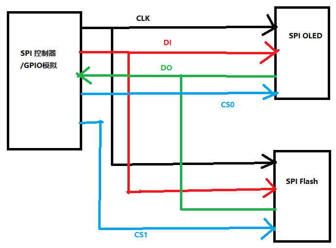

## 通信时序

* CS拉低，开始和对端通信
* 每次拉动CLK时，决定数据
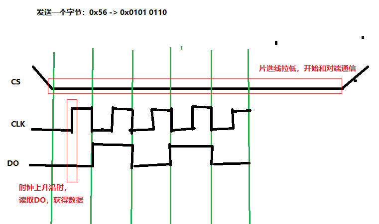

# GPIO模拟SPI，实现OLED控制
## 分析电路图,设置GPIO工作模式
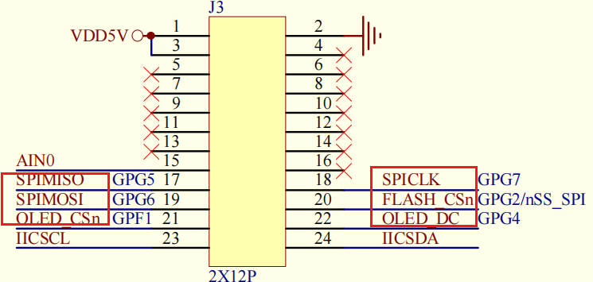
SPIMISO : 数据输入
SPIMOSO : 数据输出
OLED\_CSn : OLED片选
SPICLK : 同步时钟
FLASH\_CSn : FLASH片选
OLED\_DC : 当使用OLED时，决定数据线上传输的是命令还是数据

由于不使用控制器，所以将除 SPIMISO 设置为输入模式，其他设置为输出模式
```c
static void SPI_GPIO_Init(void)
{
    /* GPF1 OLED_CSn output */
    GPFCON &= ~(3<<(1*2));
    GPFCON |= (1<<(1*2));
    GPFDAT |= (1 << 1); // OLED_CS 拉高，不选

    /* GPG2 FLASH_CSn output
    * GPG4 OLED_DC   output
    * GPG5 SPIMISO   input
    * GPG6 SPIMOSI   output
    * GPG7 SPICLK    output
    */
    GPGCON &= ~((3<<(2*2)) | (3<<(4*2)) | (3<<(5*2)) | (3<<(6*2)) | (3<<(7*2)));
    GPGCON |= ((1<<(2*2)) | (1<<(4*2)) | (1<<(6*2)) | (1<<(7*2)));
    GPGDAT |= (1 << 2);  // FLASH_CS 拉高，不选
}
```

接下来只需要按照OLED的通信协议进行
## 看OLED手册，获得操作方法
首先需要初始化OLED，方法是发送命令序列
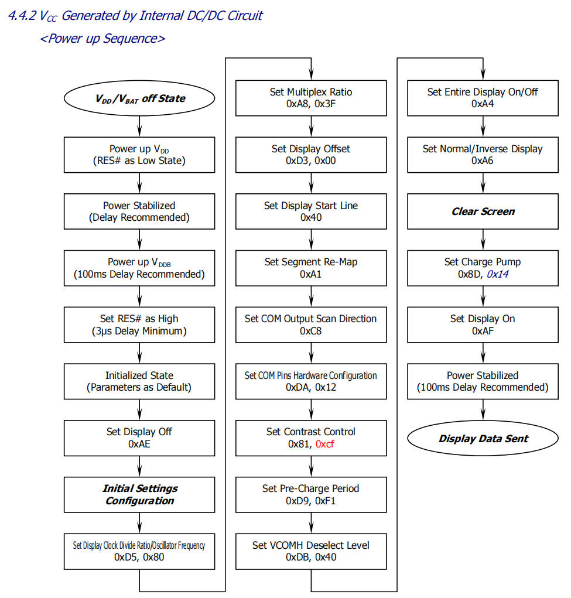
好在手册提供了相关代码

我们可以整理出如下代码
```c
void OLEDInit(void)
{
    /* 向OLED发命令以初始化 */
    OLEDWriteCmd(0xAE); /*display off*/ 
    OLEDWriteCmd(0x00); /*set lower column address*/ 
    OLEDWriteCmd(0x10); /*set higher column address*/ 
    OLEDWriteCmd(0x40); /*set display start line*/ 
    OLEDWriteCmd(0xB0); /*set page address*/ 
    OLEDWriteCmd(0x81); /*contract control*/ 
    OLEDWriteCmd(0x66); /*128*/ 
    OLEDWriteCmd(0xA1); /*set segment remap*/ 
    OLEDWriteCmd(0xA6); /*normal / reverse*/ 
    OLEDWriteCmd(0xA8); /*multiplex ratio*/ 
    OLEDWriteCmd(0x3F); /*duty = 1/64*/ 
    OLEDWriteCmd(0xC8); /*Com scan direction*/ 
    OLEDWriteCmd(0xD3); /*set display offset*/ 
    OLEDWriteCmd(0x00); 
    OLEDWriteCmd(0xD5); /*set osc division*/ 
    OLEDWriteCmd(0x80); 
    OLEDWriteCmd(0xD9); /*set pre-charge period*/ 
    OLEDWriteCmd(0x1f); 
    OLEDWriteCmd(0xDA); /*set COM pins*/ 
    OLEDWriteCmd(0x12); 
    OLEDWriteCmd(0xdb); /*set vcomh*/ 
    OLEDWriteCmd(0x30); 
    OLEDWriteCmd(0x8d); /*set charge pump enable*/ 
    OLEDWriteCmd(0x14); 
    OLEDWriteCmd(0xAF); /*display ON*/    
}
```

## 如何发送一个字节的数据 —— 考虑 CS DC
对于OLED，数据线上既可以发送数据，也可以发送命令，要通过DC线区分，
根据如下可知，0：命令，1：数据
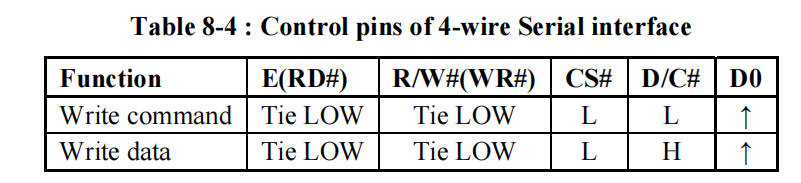
所以可以封装出发送命令和发送数据的函数
```c
static void OLEDWriteCmd(unsigned char cmd)
{
    OLED_Set_DC(0); /* command */
    OLED_Set_CS(0); /* select OLED */

    SPISendByte(cmd);

    OLED_Set_CS(1); /* de-select OLED */
    OLED_Set_DC(1); /*  */
}

static void OLEDWriteDat(unsigned char dat)
{
    OLED_Set_DC(1); /* data */
    OLED_Set_CS(0); /* select OLED */

    SPISendByte(dat);

    OLED_Set_CS(1); /* de-select OLED */
    OLED_Set_DC(1); /*  */
}
```
## 那么如何实现发送一个字节的数据 —— 考虑CLK DO
上面分析过SPI发送数据需要考虑：
片选，时钟上升沿或下降沿实现发送，
那么到底是上升沿还是下降沿的看对应芯片的数据手册(芯片都是固定的极性，SoC需要配合他)。
如下，可知是上升沿获得数据.
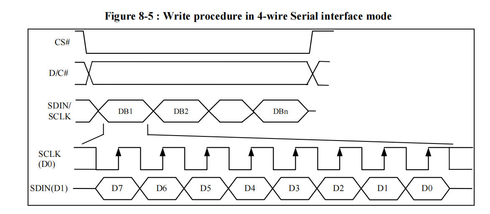
所以有如下代码

```c
static void SPI_Set_CLK(char val)
{
    if (val)
        GPGDAT |= (1<<7);
    else
        GPGDAT &= ~(1<<7);
}

static void SPI_Set_DO(char val)
{
    if (val)
        GPGDAT |= (1<<6);
    else
        GPGDAT &= ~(1<<6);
}

void SPISendByte(unsigned char val)
{
    int i;
    for (i = 0; i < 8; i++)  // 发送8bit
    {
        SPI_Set_CLK(0);  // 先将时钟线拉低
        SPI_Set_DO(val & 0x80); //  取第7位发送
        SPI_Set_CLK(1); // 将时钟线拉高，产生一个上升沿，让对方读数据
        val <<= 1; // 移动到下一位
    }
    
}
```

## 如何发送像素
### 硬件支持
根据芯片手册可以获得如下数据
* 分辨率为 128x64,对应的显存为 128x64bit，所以每个bit决定一个像素的颜色（黑白）
* OLED芯片对显存进行分页处理
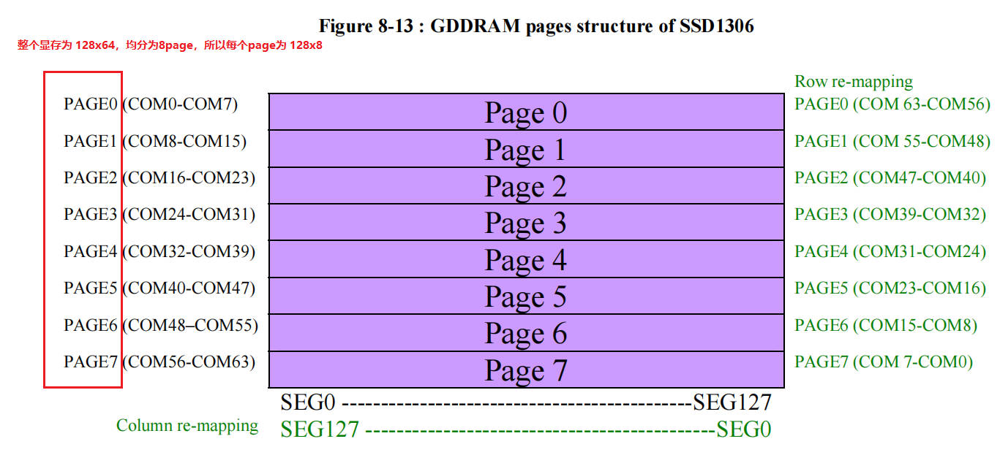
* OLED芯片对显存的读写有多种模式
a. page address mode，读写RAM后，col地址自动加1，col到达末尾自动回到起始列，page不变
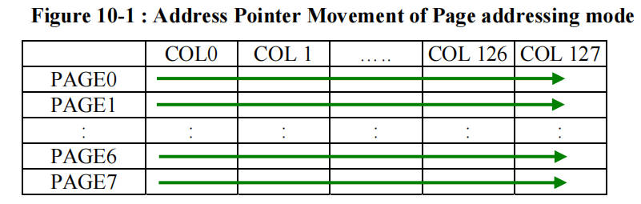
当使用这种模式，需要设置3个点
** 设置page地址
** 设置col低4位地址
** 设置col高4位地址，注意实际设置的值位 col高4位地址 + 0x10
示例
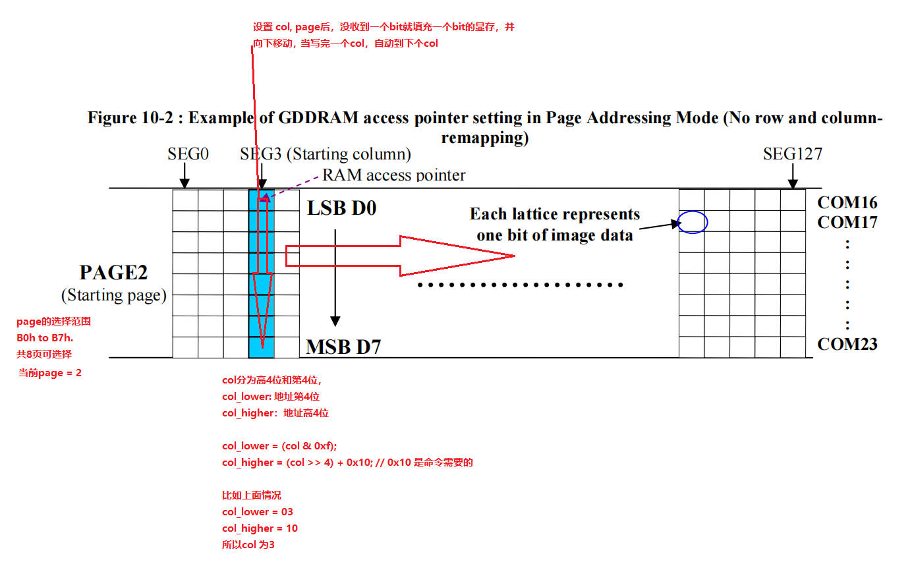
其他模式不分析

### 分析
所以发送像素步骤
1. 设置工作模式，设置page地址，设置col地址
2. 发送像素数据
3. 当一个page填充完，移动到下一个page

### 如何设置工作模式，page地址，col地址
如何使用上面模式呢？看手册命令部分
设置地址模式
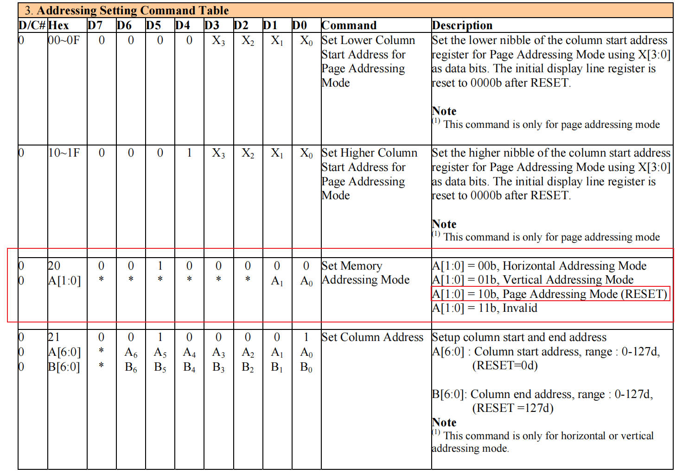
设置page
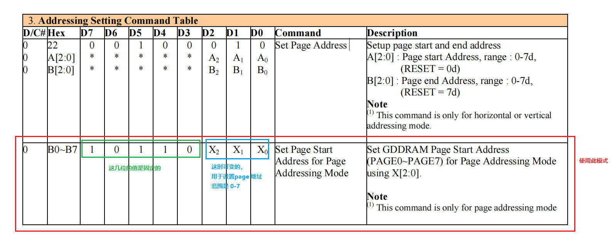
设置col
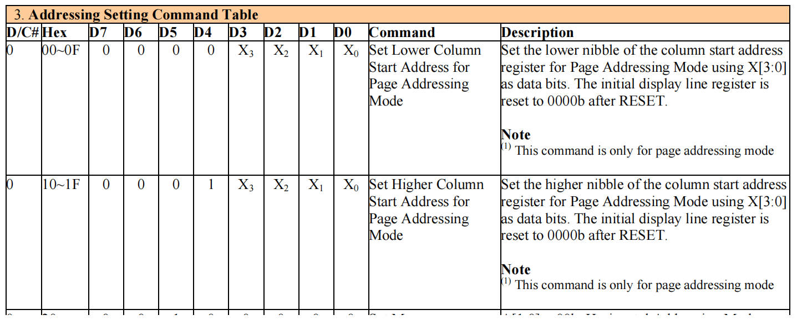

示例代码
```c
static void OLEDSetPageAddrMode(void)
{
    OLEDWriteCmd(0x20);
    OLEDWriteCmd(0x02);
}

static void OLEDSetPos(int page, int col)
{
    OLEDWriteCmd(0xB0 + page); /* page address */

    OLEDWriteCmd(col & 0xf);   /* Lower Column Start Address */
    OLEDWriteCmd(0x10 + (col >> 4));   /* Lower Higher Start Address */
}
```


### 发像素数据
发送数据和用的字模有关，比如 8x16像素
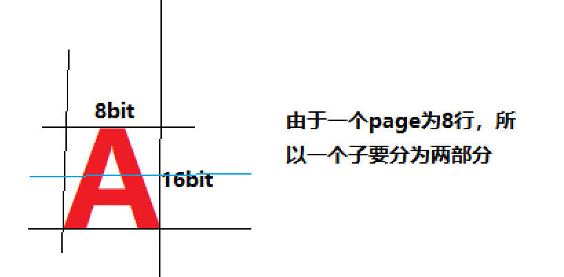
```c
/* page: 0-7
 * col : 0-127
 * 字符: 8x16象素
 */
void OLEDPutChar(int page, int col, char c)
{
    int i = 0;
    /* 得到字模 */
    const unsigned char *dots = oled_asc2_8x16[c - ' '];

    /* 发给OLED */
    OLEDSetPos(page, col);
    /* 发出8字节数据 */
    for (i = 0; i < 8; i++)
        OLEDWriteDat(dots[i]);

    OLEDSetPos(page+1, col);
    /* 发出8字节数据 */
    for (i = 0; i < 8; i++)
        OLEDWriteDat(dots[i+8]);

}


/* page: 0-7
 * col : 0-127
 * 字符: 8x16象素
 */
void OLEDPrint(int page, int col, char *str)
{
    int i = 0;
    while (str[i])
    {
        OLEDPutChar(page, col, str[i]);
        col += 8;
        if (col > 127)
        {
            col = 0;
            page += 2;
        }
        i++;
    }
}
```
